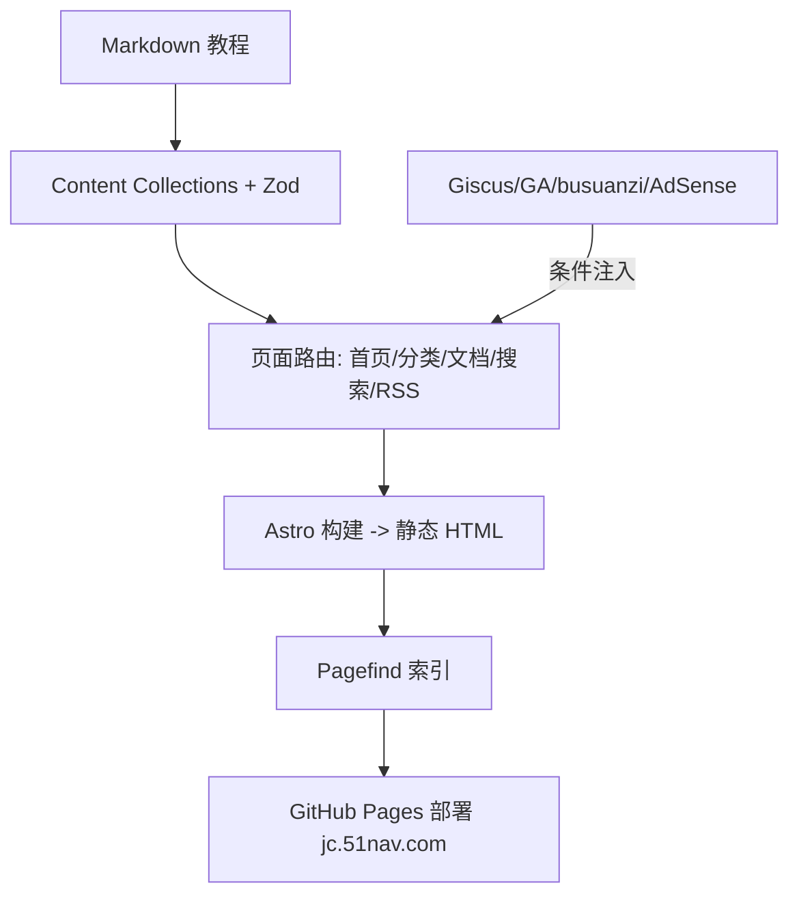

## 用户需求
搭建一个 IT 领域中文教程类网站，纯前端、无后端，部署到 GitHub Pages（自定义域名 jc.51nav.com），后期流量起来后通过 Google AdSense 变现。由 AI 先搭好框架并放置 3-4 篇示例教程，之后用户指定主题，AI 负责润色拓写。

## 产品概述
一个具有「大型教程站点」观感的静态网站，采用简约科技风。包含首页（文章列表 + 分类入口）、分类页（按分类聚合教程）、文档式阅读页（左侧目录树 + 正文 + 面包屑 + 评论 + 阅读量 + 广告位）。所有交互功能均通过纯前端/第三方静态方案实现，无任何自建后端。

## 核心功能
- 首页：站点介绍、热门/最新教程卡片、分类导航入口
- 分类页：按分类（前端/后端/运维等）聚合教程列表
- 文档阅读页：正文渲染、左侧目录树、面包屑、上一篇/下一篇、阅读量统计
- 站内搜索：构建期生成全文索引，前端模糊搜索（Pagefind）
- 文章评论：基于 GitHub Discussions 的 Giscus，纯前端脚本接入
- 阅读量统计：借助第三方服务 busuanzi（纯前端脚本，无需后端）
- RSS 订阅 + 站点地图 sitemap：利于 SEO 与 AdSense 审核
- 流量统计：预留 Google Analytics 变量（通过 GitHub 仓库 Variables 注入）
- AdSense 广告位：预留广告位组件，通过环境变量控制是否渲染，后期填 ID 即投放
- 自定义域名：仓库内置 CNAME（jc.51nav.com）


## 技术栈选择
- 框架：Astro（静态站点生成器，纯前端，构建期产出静态 HTML）
- 语言：TypeScript
- 样式：Tailwind CSS（原子化、易维护，便于统一科技风设计）
- 内容管理：Astro Content Collections（Markdown + Zod schema 校验分类/标签/摘要）
- 搜索：Pagefind（构建后索引 dist，前端零后端全文搜索）
- 评论：Giscus（GitHub Discussions 驱动的纯前端评论组件）
- 阅读量：busuanzi（纯前端计数脚本，无需自建服务）
- RSS / Sitemap：@astrojs/rss + @astrojs/sitemap
- 部署：GitHub Actions 自动构建并发布到 GitHub Pages

## 实现方案
### 总体策略
采用 Astro 内容集合驱动的内容站架构：教程以 Markdown 存放于 `src/content/tutorials/`，通过 `src/content/config.ts` 定义 schema（title、description、category、tags、pubDate、order），页面路由通过 `getCollection` 动态生成。所有第三方能力（GA、AdSense、Giscus）以 `PUBLIC_*` 环境变量注入，组件内按变量是否存在决定是否渲染，保证纯前端且不写死密钥。

### 关键技术决策
1. **Pagefind 而非 Fuse.js**：Pagefind 在 `astro build` 后扫描 `dist` 生成索引，支持中文分词与零运行时成本，最契合纯静态站；构建脚本设为 `astro build && pagefind --site dist`。
2. **Giscus 而非自建评论**：纯前端 `<script>` 注入，配置（repo、category、theme）由 `PUBLIC_GISCUS_*` 环境变量提供，无需服务器。
3. **busuanzi 而非自建统计**：一行脚本即可统计 PV/UV，满足「借助第三方服务」的约束。
4. **环境变量分层**：GA/AdSense/Giscus 用 `PUBLIC_` 前缀暴露到客户端；提供 `.env.example` 与 README 说明，部署时由 GitHub 仓库 Variables/Secrets 注入。
5. **CNAME 与 sitemap 的 site 配置**：`astro.config.mjs` 中 `site` 设为 `https://jc.51nav.com`，sitemap 与 RSS 自动使用绝对地址；`public/CNAME` 固定写入域名。

### 性能与可靠性
- 静态预渲染，首屏无 JS 阻塞；Pagefind 索引按需懒加载，避免拖慢首屏。
- 广告位、GA、Giscus 均为条件渲染，未配置时不注入脚本，零额外开销。
- Markdown 渲染走 Astro 编译期，无运行时解析成本。
- 构建期 Zod 校验内容 schema，避免分类/字段缺失导致构建失败。

## 实现要点
- 复用 Astro 官方集成（`@astrojs/rss`、`@astrojs/sitemap`、`@astrojs/tailwind`），避免自造轮子。
- `AdSlot.astro` 仅在 `import.meta.env.PUBLIC_ADSENSE_CLIENT` 存在时输出广告容器，并预留多个广告位（文首、文中、侧栏、页脚）。
- Giscus/GA/busuanzi 脚本统一在 `BaseLayout.astro` 尾部按条件注入，集中管理避免散落。
- 搜索页 `search.astro` 引入 Pagefind UI，并在构建后可用；未构建时给出友好提示。

## 架构设计
内容（Markdown）→ Content Collections（Zod 校验）→ Astro 页面路由（getCollection 动态生成）→ 静态 HTML 输出 → GitHub Pages 部署。
第三方能力在布局层条件注入，与内容渲染解耦。



## 目录结构
```
web_jc/
├── astro.config.mjs          # [NEW] Astro 配置：site=jc.51nav.com、sitemap、tailwind 集成
├── package.json              # [NEW] 依赖与脚本（build 含 pagefind）
├── tsconfig.json             # [NEW] TypeScript 配置（astro/strict）
├── tailwind.config.mjs       # [NEW] Tailwind 主题（科技风色板）
├── .env.example              # [NEW] 环境变量模板（GA/AdSense/Giscus）
├── .github/workflows/deploy.yml  # [NEW] 构建并部署 GitHub Pages
├── public/
│   ├── CNAME                 # [NEW] jc.51nav.com 自定义域名
│   └── favicon.svg           # [NEW] 站点图标
├── src/
│   ├── content/
│   │   ├── config.ts         # [NEW] 内容集合 schema（分类/标签/摘要/排序）
│   │   └── tutorials/        # [NEW] 示例教程 Markdown（覆盖 3 个分类各 1 篇）
│   ├── components/
│   │   ├── Header.astro      # [NEW] 顶部导航（Logo/分类菜单/搜索入口）
│   │   ├── Footer.astro      # [NEW] 页脚（站点地图/版权/友情链接）
│   │   ├── Sidebar.astro     # [NEW] 文档页左侧分类目录树
│   │   ├── ArticleCard.astro # [NEW] 教程卡片（封面/标题/摘要/分类）
│   │   ├── Breadcrumb.astro  # [NEW] 面包屑导航
│   │   ├── AdSlot.astro      # [NEW] 广告位（条件渲染，预留多个位置）
│   │   ├── Comments.astro    # [NEW] Giscus 评论（条件注入）
│   │   ├── ViewCounter.astro # [NEW] busuanzi 阅读量统计
│   │   └── SearchBox.astro   # [NEW] Pagefind 搜索入口/UI
│   ├── layouts/
│   │   ├── BaseLayout.astro  # [NEW] 基础布局（head/第三方脚本注入）
│   │   ├── HomeLayout.astro  # [NEW] 首页布局
│   │   └── DocLayout.astro   # [NEW] 文档阅读页布局
│   ├── pages/
│   │   ├── index.astro       # [NEW] 首页（介绍+最新教程+分类）
│   │   ├── categories/[category].astro  # [NEW] 分类列表页
│   │   ├── docs/[...slug].astro          # [NEW] 文档阅读页
│   │   ├── search.astro      # [NEW] 搜索页
│   │   ├── about.astro       # [NEW] 关于站点
│   │   └── rss.xml.js        # [NEW] RSS 输出
│   ├── styles/global.css     # [NEW] 全局样式与 Tailwind 指令
│   └── utils/site.ts         # [NEW] 站点导航/分类配置常量
└── README.md                 # [NEW] 部署与变量配置说明
```


## 设计风格
采用简约科技风（Minimalist Tech），借鉴菜鸟教程、W3Cschool、阮一峰博客等成熟中文教程站的布局逻辑，营造「大型系统化教程站点」的观感。整体以清爽浅色为底、科技蓝为主色，配合清晰的分区、卡片化列表与左侧目录树，强调信息层级与可读性。

## 页面规划
### 首页（index.astro）
- 顶部导航栏：站点 Logo、主导航（首页/分类/搜索）、搜索框入口，吸顶半透明。
- 站点介绍 Hero 区：一句话定位 + 核心分类快捷入口卡片。
- 最新教程区：横向/网格排列的 ArticleCard 列表，含封面、标题、摘要、分类标签。
- 全站分类导航区：网格展示所有分类及教程数量。
- 页脚：站点地图、关于、版权、备案占位。

### 分类页（categories/[category].astro）
- 顶部导航栏（同首页）。
- 面包屑：首页 > 分类名。
- 分类标题与简介。
- 该分类下教程卡片网格列表。
- 页脚（同首页）。

### 文档阅读页（docs/[...slug].astro）
- 顶部导航栏（同首页）。
- 面包屑：首页 > 分类 > 文章标题。
- 左侧 Sidebar：当前分类的教程目录树（高亮当前）。
- 正文区：Markdown 渲染、标题锚点、代码高亮；文首/文中/侧栏/页脚各预留 AdSlot 广告位。
- 正文下方：ViewCounter 阅读量 + Comments 评论区 + 上一篇/下一篇。
- 页脚（同首页）。

### 搜索页（search.astro）
- 顶部导航栏。
- Pagefind UI 搜索框与结果区，支持中文模糊匹配。
- 页脚。

## 交互与响应式
- 吸顶导航在滚动时背景渐显；卡片 hover 轻微上浮与阴影加深；目录树当前项高亮。
- 移动端：左侧 Sidebar 折叠为抽屉，卡片单列排列，导航折叠为汉堡菜单。
- 过渡动画柔和（150-200ms ease），不喧宾夺主。

